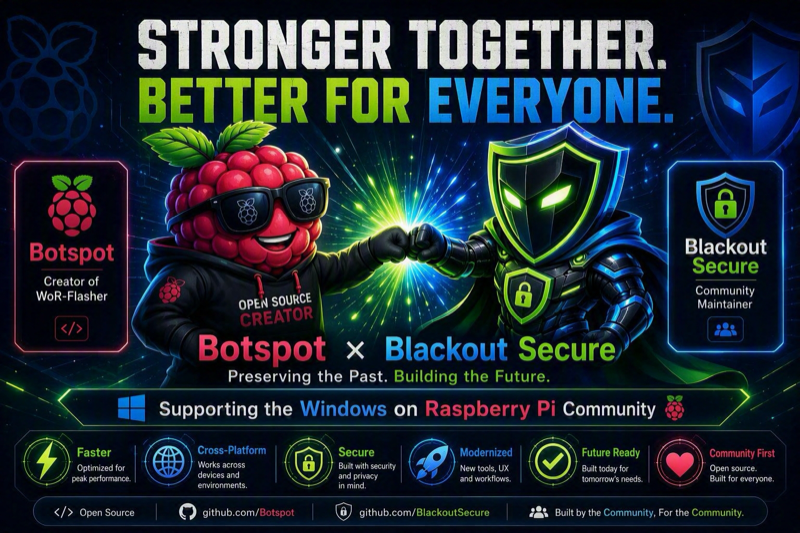
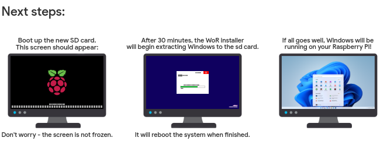

<a href="https://github.com/Botspot/pi-apps"></a>

#  WoR-Flasher



[](#versions)
[](https://github.com/blackoutsecure/wor-flasher/actions/workflows/shellcheck.yml)
[](LICENSE)
[](#requirements)
[](install-wor.sh)

[](https://discord.gg/RXSTvaUvuu)
[](https://github.com/sponsors/Botspot)
[](https://github.com/sponsors/blackoutsecure)
[](https://blackoutsecure.app)

> [!NOTE]
> [Blackout Secure](https://blackoutsecure.app/) is proud to partner with [Botspot](https://github.com/Botspot) and the [Windows on R](https://worproject.com/) community as part of this endeavour. Together, we are carrying WoR-Flasher forward while keeping Botspot's original authorship, project direction, and community connections visible.

Create a bootable Windows 10 or Windows 11 ARM64 drive for a Raspberry Pi from Linux or macOS.

WoR-Flasher downloads or imports Windows, adds the required UEFI firmware and available drivers, writes the target drive, and verifies the finished result. It automates the manual process described in worproject's [How to install from other OSes](https://worproject.com/guides/how-to-install/from-other-os) guide.

> [!WARNING]
> Flashing erases the selected drive. Check the device carefully, keep the computer powered, and do not remove the drive until verification and ejection finish.

---

## Table of contents

- [Table of contents](#table-of-contents)
  - [Compatibility](#compatibility)
  - [Requirements](#requirements)
  - [Install](#install)
  - [Pi-Apps](#pi-apps)
  - [Usage](#usage)
    - [Graphical interface](#graphical-interface)
      - [macOS walkthrough](#macos-walkthrough)
    - [Terminal interface](#terminal-interface)
    - [Non-interactive use](#non-interactive-use)
  - [Integration adapter](#integration-adapter)
  - [Parameters](#parameters)
  - [Application setup](#application-setup)
    - [Existing Windows ISO](#existing-windows-iso)
    - [Pi 4 RAM unlock](#pi-4-ram-unlock)
    - [Offline Windows setup](#offline-windows-setup)
    - [Customization templates](#customization-templates)
    - [WoR-PE options](#wor-pe-options)
    - [Download cache](#download-cache)
  - [What to expect](#what-to-expect)
  - [Updating](#updating)
  - [Troubleshooting](#troubleshooting)
  - [Development](#development)
    - [Repository layout](#repository-layout)
  - [Support](#support)
  - [Maintainer partnership](#maintainer-partnership)
  - [What this maintained source adds](#what-this-maintained-source-adds)
  - [Related resources](#related-resources)
  - [Versions](#versions)
  - [Contributing](#contributing)
  - [Contributors](#contributors)
  - [License](#license)

---

## Compatibility

| Raspberry Pi         | Newest usable Windows 11 | Limitations                                                                                                                                                                                   |
| -------------------- | ------------------------ | --------------------------------------------------------------------------------------------------------------------------------------------------------------------------------------------- |
| Pi 2 v1.2, Pi 3, CM3 | 23H2 (`22631.x`)         | No Wi-Fi or graphics acceleration; Windows 10 is usually faster                                                                                                                               |
| Pi 4, Pi 400         | 23H2 (`22631.x`)         | No Wi-Fi or graphics acceleration; RAM is limited to 3 GB by default                                                                                                                          |
| CM4                  | 23H2 (`22631.x`)         | Known to freeze at the UEFI boot screen on some units ([pftf/RPi4#146](https://github.com/pftf/RPi4/issues/146)); USB requires the RAM limit set to 1 GB, and PCIe does not work              |
| Pi 5                 | 25H2 and newer           | Community/unofficial support only ([worproject FAQ](https://worproject.com/faq#is-raspberry-pi-5-or-newer-supported)); no native Pi hardware drivers; USB Ethernet is required for networking |

Pi 3 and Pi 4 cannot run builds newer than `25163`, because those builds require ARMv8.1 atomics. WoR-Flasher rejects incompatible builds. Windows versions that run on these models are past end of support and should be treated as experimental or offline systems.

## Requirements

| Requirement  | Detail                                                                                                                    |
| ------------ | ------------------------------------------------------------------------------------------------------------------------- |
| Host OS      | Raspberry Pi OS, Debian, Ubuntu, Linux Mint or another Debian-based Linux; or macOS 13+ with [Homebrew](https://brew.sh/) |
| Privileges   | Administrator or `sudo` access                                                                                            |
| Network      | Internet access, unless every required file is already cached                                                             |
| Free space   | About 10 GB in the download directory                                                                                     |
| Target drive | At least 8 GB                                                                                                             |
| Display      | A desktop session, for the graphical interface only                                                                       |

Dependencies are installed automatically on supported hosts.

Windows, WSL and non-Debian Linux distributions are **not** supported. WoR-Flasher deliberately refuses to run under WSL: WSL cannot reach USB drives directly, and the drives it does list are WSL's own virtual disks, so erasing one would damage the WSL installation. On Windows, use the official [Windows on Raspberry Imager](https://worproject.com/downloads) instead.

## Install

```bash
git clone https://github.com/blackoutsecure/wor-flasher
cd wor-flasher
./install-wor-gui.sh
```

On macOS, Finder users can instead double-click **WoR-Flasher.app**. The app opens the same native GUI without leaving a Terminal window open. It works either inside the cloned repository or as a standalone copied application; keep the entire `.app` bundle together when moving it.

WoR-Flasher runs one GUI session per signed-in user, even if more than one checkout or version is present. Opening the app again brings the current macOS window forward instead of starting another installer workflow.

For command-line use, use the complete repository. Neither script is designed to be downloaded on its own or piped into Bash. The standalone macOS application carries a generated, integrity-checked copy of that same repository runtime rather than a second implementation.

## Pi-Apps

[Pi-Apps](https://github.com/Botspot/pi-apps) provides a graphical installation and removal path for the Linux version of WoR-Flasher. Install the **Windows Flasher** app from Pi-Apps, then open **Accessories -> WoR-Flasher** or run:

```bash
~/wor-flasher/install-wor-gui.sh
```

Pi-Apps installs the application to `~/wor-flasher` from the maintained Blackout Secure `patch-1` branch and manages its launcher and removal. See [Maintainer partnership](#maintainer-partnership) for the project history and support links.

## Usage

There are two built-in front-ends over one engine:

- **`install-wor.sh`** holds all of the logic — drive detection, download and cache handling, ISO validation, partitioning, flashing and verification.
- **`install-wor-gui.sh`** sources it and adds only the windows. It collects your choices in native dialogs, then runs `install-wor.sh` and shows a native progress window (AppKit on macOS, `yad` on Linux) instead of a visible terminal.

Both therefore write identical media from identical settings. The built-in GUI intentionally uses the engine directly because it needs shared functions and state while constructing its forms. The separate integration adapter below is a process-level contract for external tools, not an extra layer inside the GUI.

### Graphical interface

```bash
./install-wor-gui.sh
# or, equivalently:
./install-wor.sh --gui
```


The overview image shows the shared installation workflow. On macOS, the same choices are presented in native AppKit windows rather than Linux `yad` dialogs.

The front-end is never chosen automatically. `DISPLAY` is also set over SSH and in CI, and a tool that erases a drive should do exactly what it was asked to do.

An **Advanced Options** window is reachable from the confirmation screen on both platforms. It exposes every configuration-only option as a checkbox, plus an editable `config.txt`: [offline Windows setup](#offline-windows-setup), the [Pi 4 RAM unlock](#pi-4-ram-unlock), whether to use the latest UEFI firmware or drivers instead of the tested pinned versions (the pinned version is shown in each label), whether to skip the final written-image verification, and dry run. `APPLY_CUSTOM_CONFIG_TXT` controls whether the editable `config.txt` is applied at all; unchecking it dims the editor and leaves the UEFI firmware package's own default in place. A **Downloaded files** menu selects the [cache mode](#download-cache), since it has three settings rather than two.

Administrator access is requested through a native password dialog on both platforms — there is no terminal to type into.

#### macOS walkthrough

1. Double-click **WoR-Flasher.app**, or launch `./install-wor-gui.sh` or `./install-wor.sh --gui`, from macOS 13 or newer.
2. Review the partnership announcement. The **Botspot** and **Blackout Secure** names open their respective websites, and the Proceed button continues automatically after the countdown.
3. Choose the Windows version, language, Raspberry Pi model and target drive in native AppKit windows. The target drive is clearly identified before any erase operation.
4. Review the shared Installation Overview, then use **Advanced Options** for cache mode, firmware and driver choices, Pi 4 RAM handling, offline OOBE and `config.txt` customization.
5. Confirm the flash. A native progress window reports each shared installer phase, supports aborting, and retains a failure log when something stops unexpectedly.
6. After successful verification, the completion dialog provides the log controls and the next-steps guidance for moving the drive to the Raspberry Pi.

The repository does not currently include desktop captures of the macOS windows because the GUI requires an interactive macOS display session. The workflow and shared overview artwork are kept here so the documented behavior stays accurate across both front-ends.

### Terminal interface

```bash
./install-wor.sh
```

```text
Usage: install-wor.sh [--gui]

  (no arguments)  run the interactive text-mode installer
  --gui           run the graphical front-end instead
  --version       print the version and exit
  --help          show this message
```

The selected drive is erased. Drives from 8 GB to under 25 GB can create recovery media for another drive. Drives of 25 GB or more can also install Windows onto themselves. The host's current boot drive is always excluded.

### Non-interactive use

`install-wor.sh` is designed to be driven from a larger script. Set the variables it would otherwise ask about and it will not prompt:

```bash
set -a
source ~/wor-flasher/install-wor.sh source

BID="$(get_bid 11)"        # newest Windows 11 build this Pi model can run
RPI_MODEL=4
WIN_LANG=en-us
DEVICE=/dev/sda
CAN_INSTALL_ON_SAME_DRIVE=1

~/wor-flasher/install-wor.sh
```

Sourcing with the `source` argument makes the engine's functions available without running a flash. Useful ones include `list_devs`, `list_dev_paths`, `drive_capability`, `describe_device`, `get_bid`, `get_os_name`, `list_langs`, `validate_iso_file`, `list_cached_winfiles`, `settings_summary` and `install_packages`.

## Integration adapter

`install-wor-hook.sh` is the stable command-line adapter for external front-ends and automation. When it is kept next to `install-wor.sh`, it uses that engine directly. When distributed by itself, it automatically obtains a shallow copy of the complete WoR-Flasher repository in `${XDG_CACHE_HOME:-$HOME/.cache}/wor-flasher-hook`; fetching the complete checkout ensures required assets such as `config-templates/` are present. It sources the selected engine for discovery and summaries, then executes it directly for a flash.

| Command                  | Output or behavior                                                                  |
| ------------------------ | ----------------------------------------------------------------------------------- |
| `list-devices`           | Safe whole-disk candidate paths, one per line, excluding the current boot drive     |
| `describe-device DEVICE` | The supplied path with its size and model when available                            |
| `summary`                | The current settings as tab-separated `label<TAB>value` lines                       |
| `run [ARGS...]`          | Runs `install-wor.sh` with the caller's environment and any supplied engine options |

```bash
./install-wor-hook.sh list-devices
./install-wor-hook.sh describe-device /dev/sda

DEVICE=/dev/sda RPI_MODEL=4 BID=22631.2861 WIN_LANG=en-us \
  CAN_INSTALL_ON_SAME_DRIVE=1 ./install-wor-hook.sh summary

DEVICE=/dev/sda RPI_MODEL=4 BID=22631.2861 WIN_LANG=en-us \
  CAN_INSTALL_ON_SAME_DRIVE=1 ./install-wor-hook.sh run
```

Standalone bootstrap requires `git`. These variables control where the hook obtains the engine; only point them at a repository and ref you trust:

| Variable               | Default                                             | Purpose                                      |
| ---------------------- | --------------------------------------------------- | -------------------------------------------- |
| `WOR_HOOK_REPOSITORY`  | `https://github.com/blackoutsecure/wor-flasher.git` | Git repository containing the complete tool  |
| `WOR_HOOK_REF`         | `main`                                              | Branch or tag cloned by the hook             |
| `WOR_HOOK_INSTALL_DIR` | `${XDG_CACHE_HOME:-$HOME/.cache}/wor-flasher-hook`  | Persistent checkout used by standalone hooks |

Discovery is a snapshot, not authorization to erase a path later. `list-devices` rejects unsupported hosts and excludes the current boot drive, but device state can change. `describe-device` formats any supplied path and `summary` previews settings; neither validates that a device is currently safe. Call `list-devices` again before `run`, and let `run` perform the engine's final host, device, capacity and installation-mode checks. For unattended operation, provide all required values from [Parameters](#parameters); otherwise the engine can prompt for missing choices.

The adapter is transport-neutral. A GUI, desktop launcher, test harness or another local imaging application can present its own choices and invoke the same engine without copying its flashing logic. Set `WOR_GUI_PROGRESS_FILE` to a writable path to receive line-oriented, tab-separated events while `run` is active:

```text
STATUS<TAB>message
STEP<TAB>current<TAB>total<TAB>message
SUBSTEP<TAB>percent
```

The adapter returns the underlying command's exit status. Usage errors, including an unknown command or a missing `DEVICE` for `describe-device`, return `2`.

Raspberry Pi Imager supports a custom image repository through `--repo`, which is useful for publishing image metadata and downloads. It does not by itself turn an arbitrary shell flasher into an Imager write target. A future Imager integration should therefore be a deliberate adapter on the Imager side that calls this contract, rather than embedding or forking the flashing logic. See the [Raspberry Pi Imager repository](https://github.com/raspberrypi/rpi-imager) for its current repository and application integration model.

## Parameters

Every prompt has a matching environment variable.

| Variable                    | Default                    | Function                                                                                    |
| --------------------------- | -------------------------- | ------------------------------------------------------------------------------------------- |
| `DL_DIR`                    | `~/wor-flasher-files`      | Where components are downloaded and Windows images are extracted                            |
| `RPI_MODEL`                 | _ask_                      | Target Raspberry Pi: `3`, `4` or `5`                                                        |
| `BID`                       | _ask_                      | Exact Windows build ID, e.g. `22631.2861`                                                   |
| `WIN_LANG`                  | _ask_                      | Windows language code, e.g. `en-us`                                                         |
| `DEVICE`                    | _ask_                      | Target drive, e.g. `/dev/sda` or `/dev/disk4`                                               |
| `CAN_INSTALL_ON_SAME_DRIVE` | _ask_                      | `1` to install Windows onto the target itself, `0` to make recovery media for another drive |
| `SOURCE_FILE`               | unset                      | Path to an existing Windows ARM64 ISO, instead of downloading                               |
| `CONFIG_TXT`                | shipped template           | Body of `config.txt` written to the boot partition                                          |
| `APPLY_CUSTOM_CONFIG_TXT`   | `1`                        | `0` leaves the UEFI firmware package's own `config.txt` in place                            |
| `OOBE_NETWORK_BYPASS`       | `1`                        | `0` requires the standard network-connected Windows setup flow                              |
| `WINDOWS_ACCOUNT_SETUP`     | `0`                        | `1` creates the optional local Windows administrator configured in Advanced Options         |
| `WINDOWS_ACCOUNT_USERNAME`  | unset                      | Username for the optional local Windows account                                             |
| `WINDOWS_ACCOUNT_PASSWORD`  | unset                      | Password for the optional account; written to unattended setup only when enabled            |
| `WINDOWS_LOCALE_SETUP`      | `0`                        | `1` applies `WINDOWS_LOCALE` to Windows keyboard and regional settings                      |
| `WINDOWS_LOCALE`            | `en-US`                    | Locale such as `en-US` or `en-GB` used when locale setup is enabled                         |
| `PI4_AUTO_DISABLE_3GB`      | `1`                        | Pi 4 only. `0` keeps the 3 GB RAM limit                                                     |
| `UEFI_USE_LATEST`           | `0`                        | `1` queries GitHub for the newest UEFI firmware instead of the pinned version               |
| `DRIVERS_USE_LATEST`        | `1`                        | `0` uses the pinned driver package version                                                  |
| `SKIP_IMAGE_VERIFICATION`   | `0`                        | `1` skips post-flash verification. Not recommended                                          |
| `UPDATE_REPO_URL`           | blackoutsecure/wor-flasher | Git repository used by the opt-in self-updater; override for a trusted mirror               |
| `UPDATE_REF`                | `HEAD`                     | Branch or ref checked by the self-updater                                                   |
| `NO_UPDATE`                 | `1`                        | `0` opts in to fast-forwarding a clean source checkout                                      |
| `HIDE_EMPTY_DRIVES`         | `1`                        | `0` shows empty card-reader slots as selectable drives in WoR-PE                            |
| `USE_CACHE`                 | `1`                        | See [Download cache](#download-cache)                                                       |
| `DRY_RUN`                   | `0`                        | `1` runs every step except writing to the drive                                             |
| `WOR_LOG_FILE`              | `$DL_DIR/last-run.log`     | Where a failed run's log is kept                                                            |
| `VERIFY_TLS`                | `1`                        | `0` skips TLS certificate verification, for hosts with an outdated CA bundle                |
| `NO_UPDATE`                 | `1`                        | `0` opts in to the self-updater. See [Updating](#updating)                                  |
| `RUN_MODE`                  | `cli`                      | `gui` makes the engine show graphical error dialogs                                         |
| `SKIP_PACKAGE_INSTALL`      | unset                      | `1` assumes dependencies are already present                                                |

Example:

```bash
DL_DIR=/media/pi/big-drive DEVICE=/dev/sdg RPI_MODEL=4 WIN_LANG=en-us DRY_RUN=1 ./install-wor.sh
```

## Application setup

### Existing Windows ISO

Use an official Windows ARM64 ISO containing `sources/install.wim` or `sources/install.esd`:

```bash
SOURCE_FILE=/path/to/windows-arm64.iso ./install-wor.sh
```

The build number and language are read from the filename where possible, and you are asked for them if not. Customized Windows images are not supported.

### Pi 4 RAM unlock

On Raspberry Pi 4 only, the 3 GB RAM limit is disabled automatically after WoR-PE installs Windows and reboots. This setting is ignored for every other model. To keep the limit enabled:

```bash
PI4_AUTO_DISABLE_3GB=0 ./install-wor.sh
```

Windows Setup changes the pftf `RamLimitTo3GB` firmware variable during the `specialize` pass, after the injected drivers are installed, and reboots once before OOBE so the new memory map takes effect. It also clears any BCD-level `truncatememory` cap, a separate Windows Boot Manager memory limit noted in worproject's [imager customization guide](https://worproject.com/guides/wor-imager-customization#configuration-file).

> [!IMPORTANT]
> **Set `PI4_AUTO_DISABLE_3GB=0` on Compute Module 4.** Per the [worproject FAQ](https://worproject.com/faq#does-it-work-on-the-compute-module-cm), CM4 requires the RAM limit set to 1 GB — not simply left at 3 GB — for USB to work at all, and PCIe does not work regardless. WoR-Flasher cannot distinguish a CM4 from a Pi 4/400, so do not rely on the automatic default for CM4 hardware.

### Offline Windows setup

Enabled by default. WoR-Flasher writes a minimal Microsoft unattended-setup answer file that hides the OOBE network and online-account screens, so setup can continue with a local account when Pi networking is not ready yet. It does not automate accounts, licenses, partitions or privacy choices by default.

Advanced Options can optionally configure a Windows local administrator account and a locale profile before the first boot. The account username and password are written to `Autounattend.xml` only when explicitly enabled; the password is never shown in summaries or logs, but Windows setup necessarily stores it in plaintext on the prepared media temporarily. Remove `Autounattend.xml` after setup completes. The locale profile applies one value such as `en-US` or `en-GB` to the Windows keyboard/input, system, user and UI locale settings.

```bash
OOBE_NETWORK_BYPASS=0 ./install-wor.sh  # require network
```

### Customization templates

[`config-templates/`](config-templates) holds the files injected onto the media:

| File                            | Purpose                                                      |
| ------------------------------- | ------------------------------------------------------------ |
| `pi3.config.txt`                | `config.txt` body for Pi 2 v1.2 / Pi 3                       |
| `pi4.config.txt`                | `config.txt` body for Pi 4 / Pi 400                          |
| `pi5.config.txt`                | `config.txt` body for Pi 5                                   |
| `pi4-ram-unlock.ps1`            | PowerShell action that clears the Pi 4 3 GB limit            |
| `pi4-ram-unlock-specialize.xml` | Answer-file fragment that runs the above during `specialize` |
| `oobe-network-bypass.xml`       | Answer-file fragment for offline OOBE                        |

Edit these directly to customize what gets written. Both the CLI and the GUI start from the same template, so they produce identical media. Updating your checkout picks up any changes to them.

### WoR-PE options

`HIDE_EMPTY_DRIVES` (default `1`) writes `HideEmptyDrives=1` into the cached WoR-PE `settings.ini` before each run, matching worproject's [WoR-PE package option](https://worproject.com/guides/wor-imager-customization#configuration-file) of the same name, so empty card-reader slots do not show up as selectable drives during setup.

### Download cache

Downloads are stored in `~/wor-flasher-files` by default.

| `USE_CACHE` | Behaviour                                                                     |
| ----------- | ----------------------------------------------------------------------------- |
| `0`         | Remove cached components and download them again                              |
| `1`         | Reuse cache only when its source and SHA-256 payload manifest match (default) |
| `2`         | Trust the existing cache without update or integrity checks                   |

```bash
USE_CACHE=0 ./install-wor-gui.sh
```

Mode `1` refreshes changed, missing, extra or outdated cached content. Delete `~/wor-flasher-files` when you no longer need the downloads or extracted Windows images.

## What to expect

1. Downloads and verifies the PE installer, UEFI firmware, drivers and Windows image.
2. Extracts or imports the Windows image.
3. Creates FAT32 `WOR_BOOT` and ExFAT `WOR_INSTALL` partitions.
4. Copies the startup and installation files and updates `boot.wim`.
5. Verifies the partition layout, filesystems, boot files, WIM images and the copied `install.wim` checksum.
6. Unmounts and ejects the drive.

Downloads and final verification take a long time, especially on slow SD cards. Progress is shown for long operations. **Do not remove the drive until WoR-Flasher reports success.**



Move the completed drive to the Pi and connect a display, a wired keyboard and a wired mouse. Windows Setup may restart several times; do not remove power or the drive until setup completes.

## Updating

WoR-Flasher is a git checkout, so updating is a pull:

```bash
cd wor-flasher
git pull
```

An opt-in self-updater is also built in. It is **off by default** (`NO_UPDATE=1`). When enabled it only fast-forwards a clean checkout, and refuses to touch one with uncommitted changes:

```bash
NO_UPDATE=0 ./install-wor.sh
```

When launched from a source checkout, the macOS app checks the checkout's configured `origin` and current branch for an update before launch. It prompts before changing a clean checkout and applies only a fast-forward update. It silently skips the update when tracked files are modified or `HEAD` is detached, and continues with the installed revision when no update is available. Set `UPDATE_REPO_URL` and `UPDATE_REF` before opening the app from a shell to test another trusted remote or ref.

When the app is copied away from its checkout, it never modifies its own bundle. On first launch it validates the embedded runtime and copies it to `~/Library/Application Support/WoR-Flasher/runtimes/<version>/runtime`. Detached updates are staged there from release metadata over HTTPS, and are accepted only after the archive SHA-256, every extracted file digest, and every recorded file mode match the signed package manifest. Unsafe archive entries, incomplete payloads, equal versions, and downgrades are rejected. Runtime selection falls back in this order: active, previous, then the immutable embedded copy.

Check what you are running with `./install-wor.sh --version`.

### Launch repair on macOS

The app performs a bounded preflight rather than a destructive general-purpose "self-heal":

- If a required tracked script, template directory or image is absent, the app offers to restore only that missing path from the local Git `HEAD`.
- If a required Homebrew formula is absent, the app lists the exact formulae and asks before installing only those dependencies. It never runs `brew upgrade`.
- If Homebrew itself is absent, the app offers to open the official [Homebrew website](https://brew.sh/). It does not run a remote installer automatically.
- Existing modified files, untracked files, downloaded Windows content and user settings are never reset or replaced. Download recovery remains controlled by the selected [cache mode](#download-cache).

Source-file repair requires a complete Git checkout. A detached app instead validates its installed runtime and falls back to the previous or embedded runtime when the active copy is damaged; it does not attempt Git repair. If no runtime validates, the app stops with a native error instead of guessing or overwriting local work.

## Troubleshooting

If a flash fails from the GUI, the full log is kept at `$DL_DIR/last-run.log` — or wherever `WOR_LOG_FILE` points — and the path is shown in the error dialog. It is also listed on the confirmation screen before you start. Attach it to any bug report.

<details>
<summary><b>Rainbow screen</b></summary>

The Raspberry Pi firmware did not start UEFI. Reflash the drive and wait for verification to finish. Also update the Pi EEPROM bootloader, and avoid `UEFI_USE_LATEST=1` unless you are intentionally testing firmware.

On Pi 4, three ACT LED blinks indicate that `start4.elf` is missing, four indicate that it failed to launch, and seven indicate that `RPI_EFI.fd` is missing.

</details>

<details>
<summary><b>UEFI splash, then freeze</b></summary>

On Pi 3 or Pi 4, use Windows 11 build `22631.2861` or another compatible `22631.x` release. In UEFI, verify that `System Table Selection` is `ACPI` and that Secure Boot is disabled.

</details>

<details>
<summary><b>PXE boot, or no local boot option</b></summary>

Reflash with the default pinned UEFI firmware and wait for `Written image verified successfully`. WoR-Flasher pins Pi 4 UEFI to v1.50, because v1.52 and v1.53 do not boot from microSD ([pftf/RPi4#285](https://github.com/pftf/RPi4/issues/285)). Avoid `UEFI_USE_LATEST=1` on a Pi 4 for the same reason.

During first boot, Windows Setup creates Windows Boot Manager. If an installed system has lost that entry, open `Boot Maintenance Manager > Boot Options > Add Boot Option`, select `EFI\Microsoft\Boot\bootmgfw.efi`, and place it above the network boot entries.

</details>

<details>
<summary><b>Ethernet does not work, and the MAC address is all zeros</b></summary>

In Windows, `ipconfig /all` shows the Broadcom GENET adapter with a physical address of `00-00-00-00-00-00` and only an APIPA address (`169.254.x.x`). The driver is fine; the UEFI firmware never gave it a MAC.

This affects Pi 4 UEFI **v1.51 and v1.52** ([pftf/RPi4#283](https://github.com/pftf/RPi4/issues/283)). WoR-Flasher now pins v1.50, which is unaffected, so reflashing with the default settings fixes it. Do not work around it with `UEFI_USE_LATEST=1`: v1.53 fixes the MAC but does not boot from microSD.

To fix an existing installation without reflashing, either update the firmware on the boot partition using the [boot partition mount utility](https://worproject.com/downloads#boot-partition-mount-utility), or set a MAC by hand in `Device Manager` > the adapter > `Advanced` > `Network Address`.

</details>

<details>
<summary><b>Several "Unknown device" entries in Device Manager</b></summary>

Expected. No Windows drivers exist for some Pi hardware - the CYW43455 Wi-Fi, the camera interface, and VCHIQ among others. See the [driver status table](https://github.com/worproject/RPi-Windows-Drivers#status) for what is and is not supported. Wi-Fi in particular will not work; use Ethernet or a supported USB adapter.

</details>

<details>
<summary><b>WoR-PE says the initialization disk must be recreated</b></summary>

The installer cannot find unallocated space for the Windows target partition. Reflash with a current checkout and wait for final verification. Do not manually expand `WOR_INSTALL`; the unused space after that staging partition is required during installation.

</details>

<details>
<summary><b>Keyboard does not work in UEFI</b></summary>

Press `Esc` repeatedly immediately after power-on. Connect a wired keyboard directly to a USB 2.0 port, and disconnect hubs and unnecessary USB devices.

</details>

<details>
<summary><b>Only 3 GB of RAM on Pi 4</b></summary>

This is disabled automatically by default; see [Pi 4 RAM unlock](#pi-4-ram-unlock). To do it manually instead, set `Device Manager > Raspberry Pi Configuration > Advanced Configuration > Limit RAM to 3 GB` to `Disabled` (see the [worproject FAQ](https://worproject.com/faq#only-3-gb-of-ram-are-available-how-can-i-fix-this)). On Compute Module 4, set the limit to 1 GB instead; leaving it fully disabled or at 3 GB breaks USB.

</details>

## Development

```bash
./tests/run-tests.sh                # static checks, plus Linux integration where available
./tests/run-tests.sh --gui          # walk the GUI in DRY_RUN mode
./tests/run-tests.sh --walkthrough  # fake drives, then the CLI interactively
./tests/run-linux-integration.sh    # force the Dockerised Linux suite
./scripts/package-macos-app.sh --check  # verify the embedded runtime matches canonical sources
shellcheck --severity=error src/lib/*.sh install-wor.sh install-wor-gui.sh install-wor-hook.sh WoR-Flasher.app/Contents/MacOS/WoR-Flasher scripts/*.sh tests/*.sh
```

The suite creates loopback devices as stand-in drives, so nothing can be written to physical storage. Tests call the real functions out of `install-wor.sh` rather than restating their logic, which means a test cannot pass against behaviour the shipped script no longer has.

On a non-Linux host the run prints three summaries — the Docker container's nested run, the integration wrapper, then the host's own run. All three must report `failed 0`.

CI runs ShellCheck plus the suite on Ubuntu and macOS, and a one-model dry-run integration pass. See [CONTRIBUTING.md](CONTRIBUTING.md) for house style and for the traps that have already caught us.

Pushing a semantic version tag matching the canonical version in
[`src/lib/metadata.sh`](src/lib/metadata.sh) publishes a GitHub Release after those checks pass.
The same workflow can be manually dispatched with `tag_name: auto` to select the next patch, or an
explicit `vX.Y.Z` tag. By default, manual releases update the shared version metadata, macOS app
bundle metadata, documentation histories, and embedded runtime before validation; select **Do not
update project version files before validating a new manual tag** only when those changes are
already committed. A new manual tag is created and published only after validation. Each release
includes a
portable `wor-flasher-<version>-linux-rpi.zip` for Linux and Raspberry Pi OS users, a
`WoR-Flasher-<version>-macos.zip` app bundle, the app launcher's verified runtime-update payload,
and `SHA256SUMS`. The portable ZIP is also the complete release source; GitHub additionally offers
its standard source archive for each tag. The macOS app bundle is unsigned and unnotarized; verify
downloaded artifacts against `SHA256SUMS` before use.

### Repository layout

The root entry points remain stable for existing users and integrations: `install-wor.sh` is the engine and CLI, `install-wor-gui.sh` is the Linux/macOS front end, `install-wor-hook.sh` is the automation adapter, and `WoR-Flasher.app` is the native macOS launcher that Finder users double-click. `scripts/package-macos-app.sh --write` deterministically rebuilds the app's generated runtime and manifest from those canonical files; do not edit the generated runtime directly.

Shared UI artwork lives in `assets/`, and boot and setup inputs live in `config-templates/`.

Shared data and low-level helpers live under `src/lib/`. Entry points load these modules explicitly; the library files do not source one another:

| Module            | Responsibility                                                                               |
| ----------------- | -------------------------------------------------------------------------------------------- |
| `metadata.sh`     | Product identity, asset metadata and the named macOS AppleScript host                        |
| `dependencies.sh` | Homebrew and Linux package declarations shared by launcher preflight and engine installation |
| `paths.sh`        | Platform-neutral path resolution used by engine bootstrap                                    |
| `cleanup.sh`      | Shared mount, device and temporary-file cleanup registration                                 |

## Support

| Where                                                         | For                                                           |
| ------------------------------------------------------------- | ------------------------------------------------------------- |
| [Botspot/wor-flasher](https://github.com/Botspot/wor-flasher) | Report issues, share feedback, request features or contribute |
| [Botspot Software Discord](https://discord.gg/RXSTvaUvuu)     | Real-time help with WoR-Flasher                               |
| [WoR project Discord](https://discord.gg/jQCpfVK)             | Windows on Raspberry, the operating system                    |
| [worproject.com contact](https://worproject.com/contact)      | The WoR developers directly                                   |
| [Security policy](SECURITY.md)                                | Anything that should not be public                            |

## Maintainer partnership

WoR-Flasher is a community project created by **[Botspot](https://github.com/Botspot)** and directly maintained by **[Blackout Secure](https://blackoutsecure.app/)**. This partnership improves its documentation, testing and cross-platform experience while keeping Botspot's original authorship and project direction visible.

Report issues, share feedback, request features or contribute through the [Botspot/wor-flasher repository](https://github.com/Botspot/wor-flasher).

Support continued development by [sponsoring Botspot](https://github.com/sponsors/Botspot) or [buying Blackout Secure a coffee](https://github.com/sponsors/blackoutsecure?frequency=one-time&amount=8) through GitHub Sponsors.

Blackout Secure is a cybersecurity, secure application development, cloud and AI security consultancy. Its open-source work focuses on practical automation, privacy-conscious tooling and dependable developer workflows. Learn more at [blackoutsecure.app](https://blackoutsecure.app), browse the organization's projects at [github.com/blackoutsecure](https://github.com/blackoutsecure), or find Dr Bill McIlhargey through [Linktree](https://linktr.ee/billmcilhargey).

This directly maintained source is intended to strengthen the wider community around [Botspot's projects](https://github.com/Botspot), [Windows on Raspberry](https://worproject.com/) and the people who use them.

## What this maintained source adds

Building on Botspot's original work, this maintained source adds:

| Area                  | Added capability                                                                                                                                                         |
| --------------------- | ------------------------------------------------------------------------------------------------------------------------------------------------------------------------ |
| Hosts                 | macOS support alongside Debian-based Linux, including `diskutil`, `hdiutil`, `sgdisk`, native password handling and safe external-drive detection                        |
| Interfaces            | Native AppKit/JXA windows on macOS, `yad` progress on Linux, Advanced Options on both, and an explicit `install-wor.sh --gui` entry point                                |
| Installer flow        | One shared `install-wor.sh` engine with the GUI as a presentation layer, so validation, settings, downloads and flashing do not drift between front-ends                 |
| Progress and failures | File-backed progress reporting, real installer exit codes, abort handling, durable error markers and retained failure logs with a configurable `WOR_LOG_FILE` path       |
| Safety                | Boot-drive protection, free-space preflight, cached-payload SHA-256 manifests, written-image verification and clearer cache modes                                        |
| Windows setup         | Offline-OOBE support and the Pi 4 RAM-unlock action delivered to the installed OS through WoR-PE's `prefinalize.cmd` hook, rather than only copying files to media roots |
| Firmware and drivers  | Tested Pi 4 UEFI pinning, including the v1.50 choice that avoids both the v1.51 zero-MAC bug and the v1.52/v1.53 microSD boot regression                                 |
| Quality               | Cross-platform static checks, ShellCheck, loopback-drive integration tests, XML validation, mutation-tested anti-drift checks and macOS/Linux CI                         |

These additions are maintained directly by Blackout Secure in cooperation with Botspot and the wider Windows on Raspberry community.

## Related resources

- [worproject.com](https://worproject.com/) — the WoR-PE installer, UEFI firmware and drivers that WoR-Flasher assembles
- [Advanced customization guide](https://worproject.com/guides/wor-imager-customization) — the `scripts/prefinalize.cmd` hook and `settings.ini` options. Written for the official WoR imager and not verified against WoR-Flasher's headless media
- [How can I update the drivers?](https://worproject.com/faq#how-can-i-update-the-drivers) — updating drivers on an already-installed system
- [Boot partition mount utility](https://worproject.com/downloads#boot-partition-mount-utility) — mount the boot partition later to edit `config.txt` or firmware
- [PiMon](https://worproject.com/downloads#pimon) — hardware monitor (CPU temperature and so on) for Windows on Raspberry Pi
- [How to perform OS updates](https://worproject.com/guides/performing-os-updates) — using Windows Update on a WoR installation
- [BVM](https://github.com/Botspot/bvm) — Botspot's newer project: Windows 11 in a KVM virtual machine on ARM Linux, rather than on bare metal

## Versions

This maintained source uses its own version line. The product name, window title and current version are defined once in [`src/lib/metadata.sh`](src/lib/metadata.sh). The macOS launcher synchronizes those values into `CFBundleDisplayName`, `CFBundleExecutable`, `CFBundleName`, `CFBundleShortVersionString` and `CFBundleVersion` in the app property list. The same release history is repeated at the top of [`install-wor.sh`](install-wor.sh).

- **1.0.2**
  - `WoR-Flasher.app` can run independently of a Git checkout using an immutable embedded runtime, validated writable runtime copies under Application Support, and active/previous/embedded fallback.
  - Detached runtime updates reject downgrades and verify the archive digest, extracted file digests, file modes, and archive entry safety before atomic promotion.
  - A standalone `install-wor-hook.sh` now obtains a complete trusted checkout automatically when no adjacent engine is available.
  - The native macOS partnership announcement now has compatible attributed-text construction, dark-mode contrast and non-overlapping layout on current JXA runtimes.
  - A double-clickable macOS app now checks for clean fast-forward updates, installs missing Homebrew formulae with consent and offers non-destructive repair of missing tracked runtime files.
  - Repeated GUI launches now activate the existing macOS window instead of opening concurrent workflows, including launches from another checkout or version.
  - Partnership messaging and default update checks now use the directly maintained Blackout Secure source while preserving Botspot's original authorship.
  - The engine, GUI, named macOS JXA host and app property list now share the canonical `WoR-Flasher` name and `1.0.2` version metadata.
- **1.0.1**
  - **Pi 4 UEFI pinned to v1.50**, the only release where both the Ethernet MAC and microSD boot work. v1.51 (the previous pin) and v1.52 report a MAC of `00:00:00:00:00:00`, leaving Windows with no DHCP ([pftf/RPi4#283](https://github.com/pftf/RPi4/issues/283)); v1.53 fixes that but still does not boot from microSD ([pftf/RPi4#285](https://github.com/pftf/RPi4/issues/285)).
  - The Pi 4 RAM unlock and the offline-OOBE answer file now reach the installed OS through WoR-PE's prefinalize hook. The media-root copies alone were never read, because WoR-PE applies `install.wim` with DISM rather than running Windows Setup's media flow.
- **1.0.0** — First versioned Blackout Secure release.
  - **macOS host support**: `diskutil`/`hdiutil` drive discovery, and `sgdisk` GPT partitioning that keeps `WOR_BOOT` as partition 1. An extra ESP made the Pi 4 fall back to PXE boot.
  - **A native macOS interface**: AppKit/JXA wizard, progress window, Advanced Options window and error dialogs.
  - **No visible terminal in GUI mode**: the engine reports progress over a file, and each front-end renders it — AppKit on macOS, `yad` on Linux. Administrator access is requested through a native password dialog on both.
  - **Post-flash verification** of partitions, filesystems, boot files, WIM images and the copied `install.wim` checksum.
  - **Offline Windows OOBE** via a shipped `Autounattend.xml`, on by default.
  - **Automatic Pi 4 3 GB RAM unlock** after the WoR-PE reboot, including the BCD `truncatememory` cap.
  - **Pinned, overridable UEFI firmware and driver versions.** Pi 4 stays on UEFI v1.50, the only release where both the Ethernet MAC and microSD boot work.
  - **Cache modes with SHA-256 payload manifests**, a free-space preflight, and `HideEmptyDrives` written into the cached WoR-PE `settings.ini`.
  - **Editable `config.txt` from `config-templates/`**, applied by the CLI and the GUI alike.
  - **One engine, two front-ends**: `install-wor-gui.sh` sources `install-wor.sh` and adds only windows. A function defined in both files now fails a test.
  - **Explicit `--gui` entry point.** The front-end is never chosen by sniffing `DISPLAY`.
  - **A test suite**, plus ShellCheck, macOS and Linux dry-run CI.
- **0.x** — Original Botspot development history. Highlights, oldest first: the initial WoR automation, the self-updater, the "next steps" window, a complete rewrite to use ESD releases, download-to-RAM support, Pi 5 support, a GitHub API fallback for UEFI firmware, empty block devices filtered out of the drive list, and SHA-256 hashed ESD image handling.

## Contributing

Pull requests are welcome at [Botspot/wor-flasher](https://github.com/Botspot/wor-flasher) — please read [CONTRIBUTING.md](CONTRIBUTING.md) first, and [CODE_OF_CONDUCT.md](CODE_OF_CONDUCT.md).

## Contributors

**Original author.** WoR-Flasher was created by **[Botspot](https://github.com/Botspot)**, who also created [Pi-Apps](https://github.com/Botspot/pi-apps) and [BVM](https://github.com/Botspot/bvm). This maintained source rests on five years of his work, given away for free. If you find WoR-Flasher useful, [consider sponsoring him](https://github.com/sponsors/Botspot).

**Project contributors** ([historical list](https://github.com/Botspot/wor-flasher/graphs/contributors)):

|                                                                                                                      |                                                                                                                        |                                                                                                                          |                                                                                                                              |                                                                                                                        |                                                                                                                           |                                                                                                                              |
| :------------------------------------------------------------------------------------------------------------------: | :--------------------------------------------------------------------------------------------------------------------: | :----------------------------------------------------------------------------------------------------------------------: | :--------------------------------------------------------------------------------------------------------------------------: | :--------------------------------------------------------------------------------------------------------------------: | :-----------------------------------------------------------------------------------------------------------------------: | :--------------------------------------------------------------------------------------------------------------------------: |
| [<br>Botspot](https://github.com/Botspot) | [<br>Blackout Secure](https://blackoutsecure.app) | [<br>NoozAbooz](https://github.com/NoozAbooz) | [<br>Itai-Nelken](https://github.com/Itai-Nelken) | [<br>larskanis](https://github.com/larskanis) | [<br>Marcinoo97](https://github.com/Marcinoo97) | [<br>ryanfortner](https://github.com/ryanfortner) |

**Maintainer partnership.** **[Blackout Secure](https://blackoutsecure.app)** — represented here by **Dr Bill McIlhargey** ([links](https://linktr.ee/billmcilhargey)) — is partnering with **[Botspot](https://github.com/Botspot)** to provide ongoing maintenance and support while helping improve this project. Blackout Secure's contributions include macOS host support, native progress and Advanced Options windows, post-flash verification, the shared-engine refactor, documentation, community health files, the expanded test suite, and continued community support. If WoR-Flasher helps you, [consider sending Blackout Secure a cup of coffee](https://github.com/sponsors/blackoutsecure?frequency=one-time&amount=8) to support that work.

**Projects this tool assembles**, each with its own authors and license:

- [Windows on Raspberry](https://worproject.com/) — the PE-based installer
- [RPi-Windows-Drivers](https://github.com/worproject/RPi-Windows-Drivers) — Windows ARM64 drivers for the Pi
- [pftf/RPi4](https://github.com/pftf/RPi4) and [pftf/RPi3](https://github.com/pftf/RPi3) — Raspberry Pi UEFI firmware
- [worproject/rpi5-uefi](https://github.com/worproject/rpi5-uefi) — Pi 5 UEFI firmware
- [UUP dump](https://uupdump.net/) — retrieves Windows directly from Microsoft's update servers

## License

Released under the [GNU General Public License v3.0](LICENSE), matching Botspot's [BVM](https://github.com/Botspot/bvm).

> [!IMPORTANT]
> The pre-existing Botspot code shipped **without** a license file and therefore carries no explicit grant. The Blackout Secure additions are offered under GPL-3.0 without reservation. Read [NOTICE](NOTICE) before commercial redistribution or relicensing.

WoR-Flasher does **not** redistribute Windows. Proprietary components are downloaded straight from Microsoft's own update servers via [UUP dump](https://uupdump.net/). This is legal — Raspberry Pi employees [confirmed as much](https://www.raspberrypi.org/forums/viewtopic.php?f=29&t=318599#p1907313) on the Raspberry Pi Forums. The resulting installation is unlicensed, exactly like a retail Windows ISO, and needs a product key or a pre-licensed Microsoft account to activate.

No warranty. Neither Botspot nor Blackout Secure can be held responsible for data loss.
